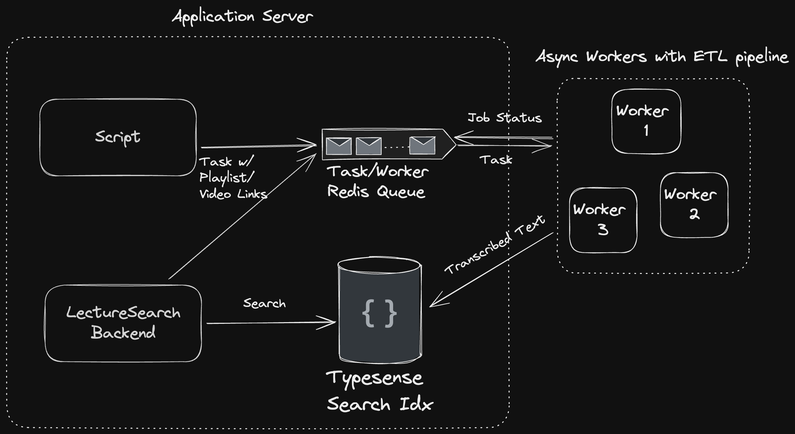

# LectureSearch

Website to help you find spoken words
Dataset v1 consists of MIT OCW videos for course 6 (Electrical Engineering & Computer Science) and 18 (Mathematics).

## Structure
1. Backend Web Server
  * Written in Rust on Axum web framework
2. Frontend
  * Written via NextJS framework
3. ETL Pipeline
  * Will be productionized as either Airflow or Windmill async job / pipeline
  * Will be deployed and run on Kubernetes workers
  * TODO: Deploy on [GPU cloud](https://vast.ai/docs/overview/introduction) and run via [FasterWhisper framework](https://github.com/SYSTRAN/faster-whisper)

## System Design

1. The backend or some script generates a task. Each task contains a set of playlist or video links.
2. Async workers pull the task from the task queue when the queue is not empty and when the workers are available.
3. To reduce cost, we use Fly.io lightweight VMs as workers that boot up (< 500 ms) only when there's a task and shuts down when it's finished processing the task. That way, we reduce idle time and only pay for resources when they're actually doing work.
4. The transcription pipeline consists of three main steps:
    * **Partition Links:** For a given task, the playlist and video links are partitioned into groups of 5-10 and written to a set of files via a Bash script. The links have to be partitioned b/c many machines don't have the compute/memory/storage resources to download and store and transcribe hundreds to thousands of videos at once (each link can be a playlist with tens of videos). If all the links are processed at once, they can run out of disk space, throttle the CPU during transcription, and run out of memory.
    * **Transcription:** The transcription bash script goes through each file serially and downloads, processes, and transcribes the videos from the links. The transcribed text is written to SRT files.
    * **Upload to Search Index:** The transcribed text is then uploaded to a search index. For this project, we're using Typesense.
    * This can be deployed to a pipeline manager (Airflow) for easy tracking and backfilling.
5. If we want to scale up the workers, we can manage and deploy them via Kubernetes. Since these are ML workloads, we can scale it even further to run on the [GPU cloud](https://vast.ai/docs/overview/introduction) and transcribe via the [FasterWhisper framework](https://github.com/SYSTRAN/faster-whisper).

NOTE: This is definitely a bit overengineered for our limited scale, but the main purpose of this project is to be a learning exercise in ML inference and distributed computing.
